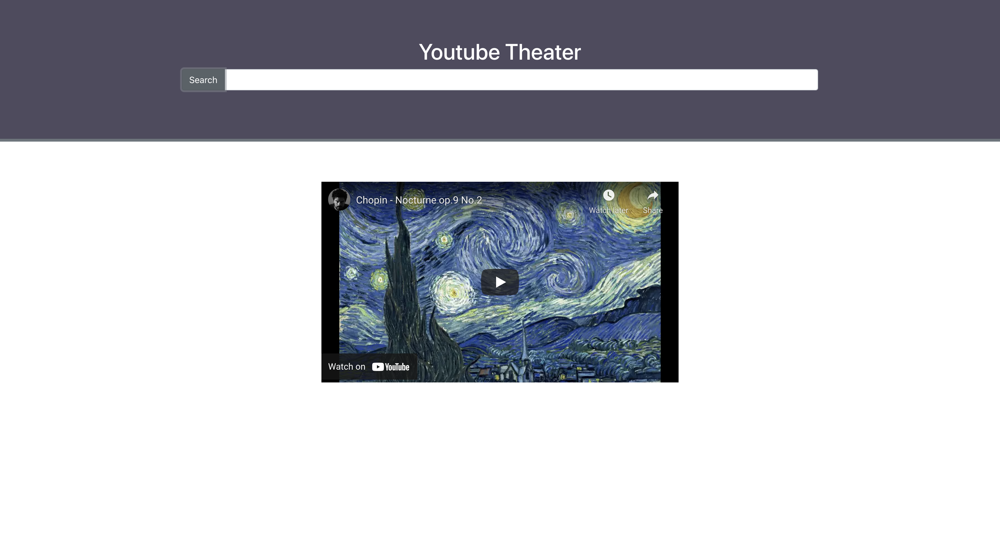

#Youtube Theater

---

Rebuilding a smaller app I made that searches for youtube videos and presents you with the results. Click on one to play.

To try it out you need a **youtube api key** from _Google_.

- Clone the repository
- run `npm install` in `youtube-theater`
- place your **api key** in the `/src/App.js` file (comment out the import if you do this)
- run `npm start` for the dev server
- **Listen to Chopin before you search anything**

